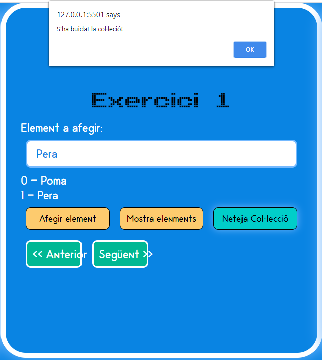

# Activitat Avaluable - MP06 - UF02

## dilluns, 8 de març de 2021 (DAW2)

Aquesta activitat servirà per poder valorar si l'alumne ha assolit els coneixements.

Es tracta de fer un clone d'aquest repositori i anar seguint totes les seccions, i a mesura que l'alumne vagi fent el que es demana a cada secció, l'alumne anirà sumant punts.


### Comandes per validar la configuració de ***```git```***
```git
$ git config --global user.name "John Doe"
$ git config --global user.email johndoe@example.com
```

## Preparació de l'entorn per fer l'activitat

Crear una carpeta localment al vostre ordinador amb el nom ***```ActAva20210308```***.

Un cop creada aquesta carpeta, obriu el ```Visual Studio Code```, i obriu la carpeta que acabeu de crear.

L'aspecte que ha de mostrar és similar al aquest.


A continuació cal que obriu una nova finestra de terminal.


Un cop oberta la nova finestra de terminal, cal que escribiu la següent comanda de git:

``` git
git clone 	https://github.com/joanpardogine/ActAva20210308.git  ActAva20210308
```


D'aquesta manera es crearà una carpeta anomenada ***```ActAva20210308```***, a on trobareu tot el codi de l'activitat.


Ara cal que creeu un nou repositori al vostre github amb el nom ```ActAva20210308```


Arribat a aquest punt, és molt important que guardeu la **url** del vostre repositori.

En el meu exemple aquesta **URL** és ```https://github.com/???/????.git```

Ara cal preparar el vincle entre el **repositori local** i el vostre **reposiroti remot a github** que acabeu de crear. Per fer-ho cal que exeecuteu la següent comanda:

``` git
git remote add ActAva20210308 https://github.com/<elVostreNomUsuariGitHub>/ActAva20210308.git
```

Per confirmar que hem creat correctament la connexió entre el repositori local i el remot, podeu executar la comanda:

```git
git remote get-url ActAva20210308
```

I la **URL** que us torna ha de ser la mateixa del vostre repositori remot al vostre **github**. 


Ara ja podeu "pujar" el **repositori local** que acabeu de crear al vostre **reposiroti remot a github** que acabeu de crear.

Per fer-ho cal que executeu la següent comanda:

```git
git push -u ActAva20210308 master
```


A partir d'ara ja teniu configurat el vostre entorn per començar a fer tots els passos que es demanen a l'activitat avaluativa.

## Així és com haurieu de veure la pàgina web, si heu seguit els passos correctament.


(llevat de la data que serà de color blanc i tindrà un altre tipus de font.)

***
> # MOLT IMPORTANT!!
> **Per a totes les activitats cal que**:
> 1. Creeu una branca des de ***```master```***, 
> 1. En acabar cal que feu un ***```merge```*** de la branca que heu creat per l'activitat, amb la branca ***```master```***
>    * Resolent els conflictes que trobeu, si en trobeu cap.
> 1. I per últim, però no menys important, que feu un ***```pull```*** perque TOTS els canvis que heu fet amb el ***```merge```*** al vostre repositori remot, quedin reflectits al vostre repositori local.

***
> ## MOLT IMPORTANT!!
> **Totes les funcions i variables que modifiqueu cal que les renombreu amb les vostres inicials al final de la funció o variable.**
> 
> **Per exemple**:
>  Si al fitxer original apareix una funció, com pot ser:
> ```js
> function mostraAlerta(){
>   let missatge = "Alerta!";
>   alert(missatge);
> }
> ```
> 
> I pel motiu que sigui us cal modificar-la, caldrà que modifiqueu el nom i guardar-la com:
> ```js
> function mostraAlertaJPC(){
>   let missatgeJPC = "Alerta!";
>   alert(missatgeJPC);
> }
> ```


>  # MOLT, MOLT, MOLT, MOLT IMPORTANT!!
> Totes aquelles activitats que no es facin creant una branca des de master, que en acabar **NO** estigui fet el merge de la branca que heu creat per l'activitat, amb la branca master **NO**, repeteixo, **NO** es tidràn en compte.
 
***
# **Primera activitat** ***(1 punt)***

**Procediment**

Afegeix les classes necessaries de ***```css```*** i aplica-les als elements de l'***```HTML```*** que ho necessitin, per que TOTS els elements quedin amagats, llevat de l'element ***```article```*** que conté el text **MP06 - UF03 Activitat avaluativa**.

> ## MOLT IMPORTANT!!
> **Durant *TOTA* l'activitat, cal que els fitxers que feu servir tinguin el següent nom**:
>
> ***```actAva_JPC.css```***
>
> ***```actAva_JPC.js```***
>
> **a on** ***```JPC```*** **seràn les inicials dels vostres *nom* i *cognoms***.

1. Crea una nova branca, des de **```master```**, amb el següent nom: **```enunciat01```***```<ElVostreCognomElVostreNom>```*
      
     - per exemple en el cas que l'usuari es digui **Albert Einstein** la branca seria **```enunciat01EinsteinAlbert```**.

1. Fes un ***```commit```*** amb el missatge "**```Primer commit activitat 1!```**"

1. Puja el teu **repositori local** al vostre **reposiroti remot a github**.

1. Fes un ***```merge```*** de la branca  **```enunciat01```***```<ElVostreCognomElVostreNom>```* amb la branca ***```master```***. Cal que resolguis tots els conflictes que t'apareguin, si t'apareix algun conflicte.

1. Recorda que per recuperar dins del vostre repositori local el que heu fet amb el ***```merge```*** de la branca  **```enunciat01```***```<ElVostreCognomElVostreNom>```* amb la branca ***```master```***. Cal que executeu la comanda ***```pull```***.

*** 
En aquest punt la vostra web ha de tenir un aspecte similar a aquest.


(llevat de la data que serà de color blanc i tindrà un altre tipus de font.)

***


# **Segona activitat** ***(1 punt)***

**Procediment**

Crea o modifica la classe que calgui per que els botons Següent i Anterior, tinguin a la mateixa distancía entre ells. 


> ## MOLT IMPORTANT!!
> **Durant *TOTA* l'activitat, cal que els fitxers que feu servir tinguin el següent nom**:
>
> ***```actAva_JPC.css```***
>
> ***```actAva_JPC.js```***
>
> **a on** ***```JPC```*** **seràn les inicials dels vostres *nom* i *cognoms***.


1. Crea una nova branca, des de **```master```**, amb el següent nom: **```enunciat02```***```<ElVostreCognomElVostreNom>```*
      
     - per exemple en el cas que l'usuari es digui **Albert Einstein** la branca seria **```enunciat02EinsteinAlbert```**.

1. Fes un ***```commit```*** amb el missatge "**```Primer commit activitat 2!```**"

1. Puja el teu **repositori local** al vostre **reposiroti remot a github**.

1. Fes un ***```merge```*** de la branca  **```enunciat02```***```<ElVostreCognomElVostreNom>```* amb la branca ***```master```***. Cal que resolguis tots els conflictes que t'apareguin, si t'apareix algun conflicte.

1. Recorda que per recuperar dins del vostre repositori local el que heu fet amb el ***```merge```*** de la branca  **```enunciat02```***```<ElVostreCognomElVostreNom>```* amb la branca ***```master```***. Cal que executeu la comanda ***```pull```***.


*** 
En aquest punt la vostra web ha de tenir un aspecte similar a aquest.


(llevat de la data que serà de color blanc i tindrà un altre tipus de font.)


***
# **Tercera activitat** ***(1 punt)***

**Procediment**
Crea el codi necessari perque funcionin els botons ***```Següent```*** i ***```Anterior```***. De manera que quan l'usuari els pitji que amagi un article i passi al següent, i que a l'usuari li sembli que pasa d'una ***finestra*** a la **següent**, o que torna a l'**anterior**.

> ## MOLT IMPORTANT!!
> **Durant *TOTA* l'activitat, cal que els fitxers que feu servir tinguin el següent nom**:
>
> ***```actAva_JPC.css```***
>
> ***```actAva_JPC.js```***
>
> **a on** ***```JPC```*** **seràn les inicials dels vostres *nom* i *cognoms***.

1. Crea una nova branca, des de **```master```**, amb el següent nom: **```enunciat03```***```<ElVostreCognomElVostreNom>```*
      
     - per exemple en el cas que l'usuari es digui **Albert Einstein** la branca seria **```enunciat03EinsteinAlbert```**.

1. Fes un ***```commit```*** amb el missatge "**```Primer commit activitat 3!```**"

1. Puja el teu **repositori local** al vostre **reposiroti remot a github**.

1. Fes un ***```merge```*** de la branca  **```enunciat03```***```<ElVostreCognomElVostreNom>```* amb la branca ***```master```***. Cal que resolguis tots els conflictes que t'apareguin, si t'apareix algun conflicte.

1. Recorda que per recuperar dins del vostre repositori local el que heu fet amb el ***```merge```*** de la branca  **```enunciat03```***```<ElVostreCognomElVostreNom>```* amb la branca ***```master```***. Cal que executeu la comanda ***```pull```***.

***
# **Quarta activitat** ***(1 punt)***

**Procediment**

El progama funciona correctament, és a dir que quan l'usuari escriu un text al quadre de text ***```Element a afegir```***, si presiona el botó ***```Afegit element```***, llavors aquest element és afegit a l'Array, és a dir, a la col·lecció, tal com es va veure a la **UF01**. I apareix un missatge a on s'indica al usuari que l'element s'ha afegit correctament.


En aquesta activitat cal que modifiqueu el codi perque quan l'element s'hagi afegit correctament a l'array, que el quadre de text, en neteji.


> ## MOLT IMPORTANT!!
> **Durant *TOTA* l'activitat, cal que els fitxers que feu servir tinguin el següent nom**:
>
> ***```actAva_JPC.css```***
>
> ***```actAva_JPC.js```***
>
> **a on** ***```JPC```*** **seràn les inicials dels vostres *nom* i *cognoms***.

1. Crea una nova branca, des de **```master```**, amb el següent nom: **```enunciat04```***```<ElVostreCognomElVostreNom>```*
      
     - per exemple en el cas que l'usuari es digui **Albert Einstein** la branca seria **```enunciat04EinsteinAlbert```**.

1. Fes un ***```commit```*** amb el missatge "**```Primer commit activitat 4!```**"

1. Puja el teu **repositori local** al vostre **reposiroti remot a github**.

1. Fes un ***```merge```*** de la branca  **```enunciat04```***```<ElVostreCognomElVostreNom>```* amb la branca ***```master```***. Cal que resolguis tots els conflictes que t'apareguin, si t'apareix algun conflicte.

1. Recorda que per recuperar dins del vostre repositori local el que heu fet amb el ***```merge```*** de la branca  **```enunciat04```***```<ElVostreCognomElVostreNom>```* amb la branca ***```master```***. Cal que executeu la comanda ***```pull```***.

***

# **Cinquena activitat** ***(3 punts)***

**Procediment**

Seguint amb la millora del funcionament, ara cal que desenvolupis el codi necessari per que en el cas en que no hi hagi cap text a l'element, en lloc d'afegir un element sense text, aparegui un missatge dient que no hi ha cap element a afegir.
Per exemple, ara si l'usuari pitja el botó ***```Afegit element```*** i no hi ha cap text al quadre de text ***```Element a afegir```***, aquest element és afegit a l'Array.

### No té sentit que afegim un element que no té nom!!!


És més, quan l'usuari demana veure els elements, realment apareix un element sense nom a la posició "correcta"?


Així doncs, en aquesta activitat cal que modifiqueu el codi perque quan no hi ha cap text al quadre de text ***```Element a afegir```***, aparegui un missatge dient que no hi ha cap element a afegir. I evidentment, no afegeixi cap element a l'Array.

> ## MOLT IMPORTANT!!
> **Durant *TOTA* l'activitat, cal que els fitxers que feu servir tinguin el següent nom**:
>
> ***```actAva_JPC.css```***
>
> ***```actAva_JPC.js```***
>
> **a on** ***```JPC```*** **seràn les inicials dels vostres *nom* i *cognoms***.

1. Crea una nova branca, des de **```master```**, amb el següent nom: **```enunciat05```***```<ElVostreCognomElVostreNom>```*
      
     - per exemple en el cas que l'usuari es digui **Albert Einstein** la branca seria **```enunciat05EinsteinAlbert```**.

1. Fes un ***```commit```*** amb el missatge "**```Primer commit activitat 5!```**"

1. Puja el teu **repositori local** al vostre **reposiroti remot a github**.

1. Fes un ***```merge```*** de la branca  **```enunciat05```***```<ElVostreCognomElVostreNom>```* amb la branca ***```master```***. Cal que resolguis tots els conflictes que t'apareguin, si t'apareix algun conflicte.

1. Recorda que per recuperar dins del vostre repositori local el que heu fet amb el ***```merge```*** de la branca  **```enunciat05```***```<ElVostreCognomElVostreNom>```* amb la branca ***```master```***. Cal que executeu la comanda ***```pull```***.

***

# **Sisena activitat** ***(4 punts)***

**Procediment**

Ara mateix el programa funciona de manera que quan l'usuari vol buidar la col·lecció, presiona el botó ***```Neteja col·lecció```*** i simplement, apareix un missatge que ens informa de que ***```S'ha buidat la col·leció!```***, pero no es buida ni el quadre de text ***```Element a afegir```***, ni desaparexi el text que mostra la col·lecció.



És més, quan l'usuari demana veure els elements, realment apareix un element sense nom a la posició "correcta"?


> ### No té sentit que NO s'esborri, ni el text que mostra la col·lecció, ni l'element que pugui apareixer al quadre de text ***```Element a afegir```***, ja que la col·lecció és buida!!!

Així doncs, en aquesta activitat cal que modifiqueu el codi perque quan es buidi la col·lecció, s'esborri, tant el text que mostra la col·lecció, com el text de qualsevol element que pugui apareixer al quadre de text ***```Element a afegir```*** 

> ## MOLT IMPORTANT!!
> **Durant *TOTA* l'activitat, cal que els fitxers que feu servir tinguin el següent nom**:
>
> ***```actAva_JPC.css```***
>
> ***```actAva_JPC.js```***
>
> **a on** ***```JPC```*** **seràn les inicials dels vostres *nom* i *cognoms***.

1. Crea una nova branca, des de **```master```**, amb el següent nom: **```enunciat06```***```<ElVostreCognomElVostreNom>```*
      
     - per exemple en el cas que l'usuari es digui **Albert Einstein** la branca seria **```enunciat06EinsteinAlbert```**.

1. Fes un ***```commit```*** amb el missatge "**```Primer commit activitat 6!```**"

1. Puja el teu **repositori local** al vostre **reposiroti remot a github**.

1. Fes un ***```merge```*** de la branca  **```enunciat06```***```<ElVostreCognomElVostreNom>```* amb la branca ***```master```***. Cal que resolguis tots els conflictes que t'apareguin, si t'apareix algun conflicte.

1. Recorda que per recuperar dins del vostre repositori local el que heu fet amb el ***```merge```*** de la branca  **```enunciat06```***```<ElVostreCognomElVostreNom>```* amb la branca ***```master```***. Cal que executeu la comanda ***```pull```***.

***   
